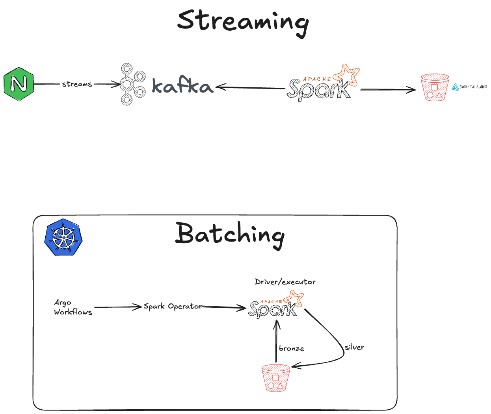

+++
authors = ["Carlos Zansavio"]
title = "Building a data platform in my homelab - Part 1"
date = "2026-07-11"
description = "Let's build a data platform together"
tags = [
    "data-engineering",
]
categories = [
	"data",
]
draft = true
+++

Some of you might know that I have some services running indentifly, using a homelab that I've been building for more than two years now.
These services help me store personal files but I also provide services to local community.

I do data engineering for a living (you also must know that), but I don't have my own data platform. I started feeling that it must be the momento to do that. I have all the infraestructure and knoledge to do that.

So now i'm starting this new series about how I'm building a data plataform for my services.

# Day 1
We have to start by designing the data platform. We don't need to have every detail in mind already, but we need to have a scaffold, in order to create a work plan.
I already have servers that provides VMs. I have installed kubernetes and some nodes. So I'm going to use Kubernetes as the `Cluster Manager`.


So this is a very basically open source data platform. Nothing fancy (and I don't need/want it).

I want to start working on the streaming because I need to solve a problem: I want to analyze logs from my nginx servers. I wouldn't need to create a whole data platform for only this problem, but I will have more problems in the future that this data plataform can solve ;).

I see that I need to work on these topics:
- [x] MinIO
- [x] Kafka
- [x] Streams nginx logs to Kafka topic
- [ ] Read streaming data locally, process it
- [ ] Plan the deploy

May be:
- [ ] Catalog
- [ ] Trino
- [ ] Metabase

It's important to say that I don't have infraestructure to deploy fault tolerance projects. It's a simple infraestructure to solve simple problems (and to study).
# Day 2
We have to start by where the data will be stored. I'm going to use MinIO, which is already consolatidated in the market.
So I provide a 2GB RAM VM and install it using podman. I use a SSD storage instead the NVMe.
Once that's working, I check it if it's working creating a folder called `lakehouse/` and uploading a mock file there.
# Day 3
Now it's the time to build the broker. I'll use Kafka with Kraft. Very simple deploy using podman. Using a 2GB RAM VM.
I had no problem with this, it was pretty straight forward. I tested it using kafka `/opt/kafka/bin/` and it seems it's working (until now haha)

# Day 4
Ok, this is the day that things gets interesting. We need to get Nginx logs and streams it to the Kafka we deployed yesterday. I'm going to use [Fluentbit](fluentbit.io) as the engine to send these logs to Kafka. It's lightweight and preferred choice for containerized environments.
So, I created the fluentbit compose file. When I went to configure the nginx conf file, I saw that it was dangerous to do that without a backup (as I have daily users). So, I stopped and will come back next day.

# Day 5
The issue here is that I have a Nginx Proxy Manager as my Nginx proxy and not only a nginx vanilla deployment.
After checking my backup, I added in `/data/nginx/custom/http_top.conf`:

```nginx
log_format json_combined escape=json
  '{'
    '"time":"$time_iso8601",'
    '"remote_addr":"$remote_addr",'
    '"request_method":"$request_method",'
    '"request_uri":"$request_uri",'
    '"status":$status,'
    '"body_bytes_sent":$body_bytes_sent,'
    '"request_time":$request_time,'
    '"upstream_response_time":"$upstream_response_time",'
    '"http_referer":"$http_referer",'
    '"http_user_agent":"$http_user_agent",'
    '"host":"$host"'
  '}';
```
And added in `/data/nginx/custom/server_proxy.conf`:

```nginx
access_log /data/logs/json-access.log json_combined;
```
Every proxy host will now log to that single JSON file in the same format, with no manual per-host "Advanced" tab edits.
Restarted the server and it worked like a charm :).
Now I need to get these logs from FluentBit to stream this data to Kafka. 
After some checks, I make it work. Now we have the streaming on the topic:
```
root@debian:~# podman exec -it kafka /opt/kafka/bin/kafka-console-consumer.sh   --topic nginx-access-logs --bootstrap-server localhost:9092

{"time":1784146120.0,"remote_addr":"172.71.195.41","request_method":"GET","request_uri":"/robots.txt","status":200,"body_bytes_sent":2105,"request_time":0.001,"upstream_response_time":"0.001","http_referer":"","http_user_agent":"Mozilla/5.0 AppleWebKit/537.36 (KHTML, like Gecko; compatible; bingbot/2.0; +http://www.bing.com/bingbot.htm) Chrome/116.0.1938.76 Safari/537.36","host":"carlos.sjdr.cloud"}
```

Perfect, the data is being streamed by FluentBit. I can consume using Kafka on the next days.
# Day 6