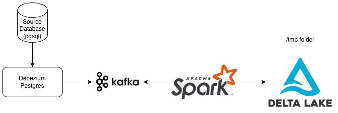

+++
authors = ["Carlos Zansavio"]
title = "Building a CDC Streaming Pipeline locally"
date = "2026-07-05"
description = "Let's build a CDC streaming pipeline locally."
tags = [
    "data-engineering",
]
categories = [
    "tutorial",
]
+++

# Introduction
Want to understand what a Change Data Capture (CDC) streaming pipeline is and how to build one locally with Docker? Let me help you. This is a POC project to understand how things work in real life.

You can find the repository [here](https://github.com/carloszan/cdc).
# What's CDC Streaming pipeline?
CDC stands for Change Data Capture. In simple terms, it streams database update logs to a topic (if using Kafka), so other systems can stay in sync with the source database in near real-time. This approach is especially useful for feeding data into Online Analytical Processing (OLAP) platforms, where analysts need fresh data to work with.

## The problem
The core issue is real-time database replication, particularly for OLAP use cases.

## Why Replicate Databases at All?
Here's the thing: analysts can't just query the production database (OLTP) directly. One heavy query and they might lock up tables or even crash the system. So data engineers step in to build ETL (or ELT) pipelines that move data from production to safer environments where the data team can explore freely.

There are different ways to extract this data. Batch processing is the traditional approach—run a job every night, move a chunk of data, done. But what if you need updates as they happen? That's where CDC streaming shines, as you can receive the data continuously.

## The price
Of course, nothing comes for free. The price of real-time is infrastructure. You need to deploy or rent a Kafka cluster, which can get expensive fast. Furthermore, your processing engine has to stay running 24/7. That adds operational overhead (more things to monitor). Compared to a scheduled batch job that runs and finishes, a streaming pipeline demands constant attention.

# System Design
This is a POC meant to run locally on your machine, not a production-grade setup. We will keep things simple so you can see the moving parts without getting lost in enterprise complexity.
## Components

- Postgres: Your source database. This is where the original data lives and changes happen.
- Debezium: This is the connector that reads the transaction logs from Postgres and pushes every change to Kafka.
- Kafka: The streaming platform that acts as the central hub. All change events flow through here before they get processed.
- Apache Spark: The processing engine that consumes the events from Kafka, transforms them if needed, and writes the data out to the final destination.
- Delta Lake: This is where we'll build our OLAP layer. In a real production scenario, you'd store these Delta files in cloud blob storage (such as S3, Azure Blob Storage, R2). For this local POC, though, we'll just write everything to a `/tmp` folder on your machine. Good enough for testing.
## Design


## About Debezium
You might be wondering: how does Debezium actually capture those changes?

First, you need to enable logical replication in Postgres. That means turning on the WAL (Write-Ahead Log) at the right level so Postgres actually logs every change with enough detail for Debezium to read.

Once that's set up, Debezium connects to Postgres using the same replication protocol that Postgres uses internally to sync data across cluster nodes. It basically acts like a replica, staying plugged into the replication stream and listening for new changes.

So here's how it flows: a user updates a row in Postgres. That change gets written to the WAL. Debezium picks it up from the replication stream, packages it into an event, and publishes that event to a Kafka topic. From there, any other service can subscribe and act on that change.

One important thing to note: Debezium doesn't poll the database for changes. It doesn't run queries like `SELECT * FROM table WHERE updated_at > last_run`. Instead, it streams the changes directly from the log. No extra query load on your production database.
# Running

Alright, let's get this thing running.

Start by cloning the [GitHub repository](https://github.com/carloszan/cdc). Then open the _devcontainer_ that's already configured inside the repo. This part matters because Spark runs inside the container, and it needs to communicate with the other services we'll spin up with Docker Compose.

Once you're inside the _devcontainer_, run these commands in order:

```bash
# 1. Start all services
cd cdc && docker compose up -d

# 2. Wait for Kafka Connect to be ready (~60s)
until curl -sf http://localhost:8083/connectors; do sleep 3; done && echo "Ready"

# 3. Register the Debezium PostgreSQL connector
bash connector/register-connector.sh

# 4. Verify connector is running
curl -s http://localhost:8083/connectors/postgres-cdc-connector/status
```

Here's what each step does:

- **Step 1** spins up all the services defined in the compose file: Postgres (the source), Kafka 3.7 with KRaft (no Zookeeper needed), Debezium (the connector service), and Kafka-UI (so you can peek at your topics visually).
- **Step 2** just waits until Debezium's API is responsive—it takes about a minute to fully initialize.
- **Step 3** registers Postgres as a source connector inside Debezium, telling it which database to watch and which Kafka topic to publish changes to.
- **Step 4** is a quick sanity check to confirm the connector is up and running.

With everything up, navigate to `cdc/spark/cdc_consumer.py` and run the script. This consumer does a few things: it defines the customer schema, sets up the envelope structure Debezium uses, installs the Delta Lake packages, and configures Spark with some extensions we'll need. You'll also notice we set `spark.sql.shuffle.partitions` to 2, fine for local testing, but don't do this in production.

The script then transforms the raw change events into something more readable and sinks the data to two places: the console (so you can see events streaming in real time) and Delta Lake (so you have persistent data to query later).

The checkpoint files—Spark uses these to track what it has already processed—live at `/tmp/cdc-checkpoint/customer`, and the actual Delta tables end up in `/tmp/cdc-delta/customer`.

## How to Insert, Update, or Delete Data

Now we need to actually change some data in Postgres and watch the pipeline react. You could run SQL commands directly, but I've included a helper script to make it easier: `bash postgres/cdc_test.sh`.

To insert a new record:

```bash
# Let the script generate an ID for you
bash postgres/cdc_test.sh insert

# Or specify your own values
bash postgres/cdc_test.sh insert 99 "Eve Torres" "eve@example.com"
```

To update an existing record:

```bash
# Update just the email
bash postgres/cdc_test.sh update 99

# Update both name and email
bash postgres/cdc_test.sh update 99 "Eve T."
```

To delete:

```bash
bash postgres/cdc_test.sh delete 99
```

Every change you make will immediately flow through Debezium into Kafka, get picked up by Spark, and appear in your console output within seconds.

## Checking the Changes

The console sink gives you a live view, but sometimes you want to inspect the data that's been stored. That's what `cdc/spark/rebuild_state.py` is for. It reads the Delta tables and shows you what the current state looks like, reconstructing a view of your database.

Think of this as a quick way to simulate what you'd do in a Silver layer: clean up the raw CDC events and present them as a proper table.

Give it a run and see the changes reflected.

# Conclusion

Look, you don't need to memorize every line of code here. The real takeaway is understanding the trade-offs. CDC streaming is powerful as you get near-real-time replication with minimal impact on your source database. But it comes with operational complexity: you're maintaining Kafka, Debezium, and a streaming engine. It's more expensive than batch, harder to debug.

When is it worth it? When your analysts genuinely need fresh data by the minute.

This POC gives you a solid foundation. You've seen the components, you've run the pipeline, you've poked at the data. Now you can decide if real-time is the right tool for your next project.

If you want to go deep, I highly recommend checking  [the QA, found inside the repository](https://github.com/carloszan/cdc/blob/main/cdc/QA.md).